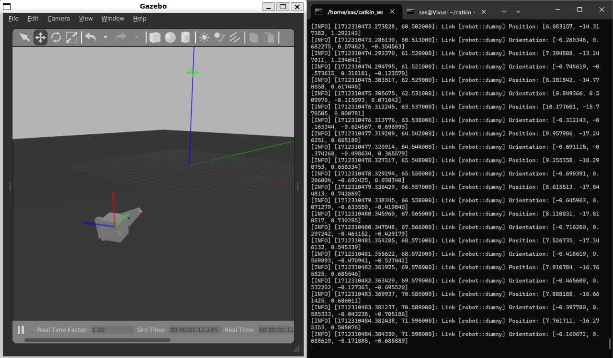

# Bipedal robot
#### Description
Publishes joint efforts return link coordinates


#### Usage
Clone the repository
```
cd ~/catkin_ws/src
git clone https://github.com/my-sas/roboarm_test
```
Build catkin workspace:
```
cd ~/catkin_ws
catkin_make
source devel/setup.bash
```
Launch simulation:
```
roslaunch bipedal_robot gazebo.launch
```

